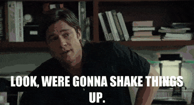

<h1> Capstone Project: NEAT Scouting Data Analytics - Identifying Undervalued Assets Overlooked by Others :basketball: </h1>  

<h2> Company Overview </h2>  

*  We are a startup specializing in sports scouting, dedicated to identifying European basketball players who are fit to play in the NBA.

*  Our Slogan: Identifying Undervalued Assets Overlooked by Others

*  We provide insights into potential countries and players in Europe worth scouting.

  

<h2> Project Goal and Scope </h2>  

*  **Highlight Key Statistical Differences**: Identify where European basketball players excel in comparison to their US and international counterparts.
  
*  **Identify Emerging Talent**: Focus on specific European countries showing potential based on key basketball performance indicators (KPIs) for each playing position (centers, forwards, and point guards).
  
*  **Deliver an Interactive Dashboard**: Create an intuitive Tableau dashboard that allows clients to effectively search for and analyze suitable prospects.

<h2> Approach </h2>

**1. Data Collection**
We initially sourced datasets from OurWorldInData.org, then expanded our research to include the Global Burden of Disease (GBD) dataset, which covers mental diseases, suicide rates, and related measures from 1990 to 2019. To delve into individual-level data, we examined social media, central ladder scores, subjective income vs. depression history, mental health professional availability and affordability, and social connection/loneliness. Our largest survey source was the Wellcome Global Questionnaire, with 119,000 entries.

**2. Data Cleaning and Preparation**
We cleaned, processed, and prepared the dataset to ensure accuracy, consistency, and reliability for analysis and visualization in Tableau.

**3. Data Analysis**
Using Python in VS Code, we performed exploratory, trend, and comparative analyses to uncover insights, correlations, and patterns related to mental health disorders and suicide.

**4. Data Management**
To efficiently manage our datasets and collaborate, we stored them in a PostgreSQL database, accessed via a Python connection and engine.

**5. Visualization**
We developed informative visualizations, including line charts, bar and column charts, heat maps, bubble charts, tree maps, scatter plots, and interactive dashboards, to effectively present and communicate our data and insights.

**6. Presentation**
For our presentation, we compiled all charts in Google Slides. Check out our final live presentation here.

<h2> Don't Be Too Harsh on Us Yet...  🛠️</h2>

The project is complete and the code is available in this repo, but certain parts still need to be cleaned and enhanced.

Final stakeholder presentation is available here. 

Our dashboard video demo available [here](https://drive.google.com/file/d/1v8VPUzXmcHHPwnnUjC3OO-MOWdK4WD4C/view?usp=drive_link).  Feel free to check it out! Stay tuned folks! ✌️

<h2> Disclaimer :exclamation:</h2>

<h6>Please note that this project is non-profit and intended solely to simulate a real-life scenario for educational purposes. The data scraped from NBA.com and Basketball.Realgm.com has not been used for any commercial purposes. The scenario of a scouting agency is entirely fictional, created to fulfill the requirements of a data capstone project.</h6>
